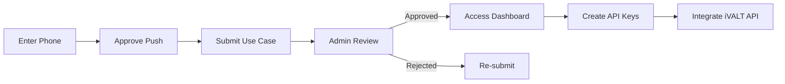

# iVALT Developer Portal — End-User Flow

This guide walks through the complete journey from first login to managing production API keys.

## Quick Overview



---

## Step 1 — Login with Biometrics

1. Navigate to the portal URL (e.g. `https://ivalt-api-portal.vercel.app`)
2. Enter your mobile number with country code (`+919876543210`)
3. Tap **Continue** — a push notification is sent to your iVALT app
4. Open the iVALT app on your phone and **approve** the authentication request
5. Your browser detects the approval and proceeds automatically

> **Need the iVALT app?** Download it from the App Store or Google Play and register your phone number first.

### Troubleshooting Login

| Issue | Solution |
|-------|----------|
| "Phone number not registered" | Install iVALT app and register first |
| Push not received | Check internet on your phone, try again |
| Request timed out | Refresh the page and restart |
| App shows "Failed" | Ensure strong biometric scan |

---

## Step 2 — Submit Access Request

New users must describe their integration before accessing the dashboard.

1. After authentication, you are redirected to the **Access Request** form
2. Fill in your **use case** — describe what you are building and how you plan to use iVALT biometrics
3. Click **Submit Request**

Your request is now pending admin review. You will receive an email notification when a decision is made.

### Writing a Good Use Case

Include these details for faster approval:
- **What** you are building (mobile app, web platform, internal tool)
- **How** biometric authentication fits into your flow
- **Expected** user volume and frequency
- **Timeline** for going live

### What Happens Next

```
Submit → Admin notified via email
       → Admin reviews in dashboard
       → Decision made (approve/reject)
       → Email sent to you with result
```

---

## Step 3 — Access Approved

Once approved, you receive an email with the subject **"Access Approved — iVALT Portal"**.

You can now:
1. **Sign in** at the portal URL
2. **Create API keys** from the API Keys dashboard (up to 4 keys)
3. **Read the API docs** in-app for integration details
4. **Start integrating** the iVALT biometric flow into your application

### Quick Start Checklist

- [ ] Create your first API key from `/dashboard/keys`
- [ ] Save the key value immediately — it is shown only once
- [ ] Review the API endpoints in the in-app docs
- [ ] Build the auth flow: request → poll → handle response
- [ ] Test with a small user group before production launch

---

## Step 4 — Manage API Keys

### Create a Key

1. Go to **API Keys** in the sidebar
2. Enter a descriptive name (e.g. "Production App", "Mobile SDK")
3. Click **Create Key**
4. **Copy and store the key value** — it will not be shown again

### Enable / Disable a Key

Use the toggle switch to temporarily disable a key without deleting it. Disabled keys return 403 on the iVALT API.

### Delete a Key

Click the delete icon. This removes the key from AWS permanently. Any applications using this key will lose access immediately.

### Key Limits

- Maximum **4 keys** per account
- Delete unused keys to stay within the limit

---

## Step 5 — Integrate the iVALT API

### Authentication Headers

Every API call requires these headers:

| Header | Value | Purpose |
|--------|-------|---------|
| `x-api-key` | Your API key | Identifies your application |
| `token` | Your iVALT security token | Authenticates your account |
| `Content-Type` | `application/json` | Request format |

### Flow: Initiate Authentication

```
POST https://api.ivalt.com/biometric-auth-request
```

Send a push notification to the user's iVALT app:

```bash
curl -X POST https://api.ivalt.com/biometric-auth-request \
  -H "Content-Type: application/json" \
  -H "token: YOUR_IVALT_SECURITY_TOKEN" \
  -H "x-api-key: YOUR_API_KEY" \
  -d '{"mobile_number": "+919876543210"}'
```

**Response:** `200` with `request_id` — the user now has a pending approval on their phone.

### Flow: Poll for Result

```
POST https://api.ivalt.com/biometric-auth-result
```

Poll every 2 seconds until a terminal status is reached:

```bash
curl -X POST https://api.ivalt.com/biometric-auth-result \
  -H "Content-Type: application/json" \
  -H "token: YOUR_IVALT_SECURITY_TOKEN" \
  -H "x-api-key: YOUR_API_KEY" \
  -d '{"mobile_number": "+919876543210"}'
```

### Status Code Reference

| Code | Meaning | Action |
|------|---------|--------|
| **200** | Authenticated | User verified. Create a session. |
| **422** | Pending | Keep polling every 2 seconds |
| **403** | Failed / Timeout | User rejected or window expired. Show error. |
| **404** | Not found | Phone not registered in iVALT. Prompt sign-up. |

### Geo-fence Verification

Add location constraints to the poll request:

```bash
curl -X POST https://api.ivalt.com/biometric-auth-result \
  -H "Content-Type: application/json" \
  -H "token: YOUR_IVALT_SECURITY_TOKEN" \
  -H "x-api-key: YOUR_API_KEY" \
  -d '{
    "mobile_number": "+919876543210",
    "latitude": 30.7333,
    "longitude": 76.7794,
    "radius_meters": 500
  }'
```

Returns `200` only if the user is authenticated **and** within the geofence. Returns `403` if outside.

---

## Demo Mode

When `NEXT_PUBLIC_DEMO_MODE=true` is set:
- Authentication is simulated (no real push notification)
- User is auto-approved
- Demo API keys are shown for testing
- No database or AWS credentials required

Use demo mode for UI development and testing.

---

## Support

- **Email:** support@ivalt.com
- **Portal:** https://ivalt-api-portal.vercel.app
- **API Base:** https://api.ivalt.com
